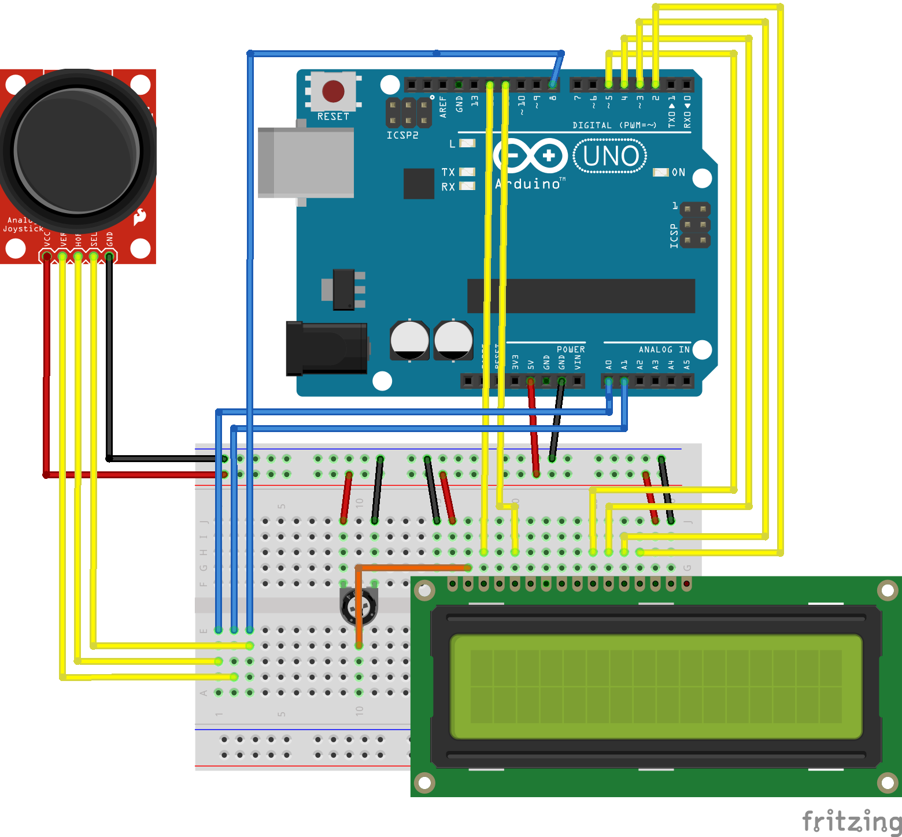

#Arduino: a Simple Game

A simple game for Arduino that simulates an easy Snake clone. 

Demo: https://www.youtube.com/watch?v=UlDwQlW7Zc0

Components used:

* · Arduino UNO R3 Controller Board.
* · Breadboard.
* · LCD1602 Module.
* · Rotary Potentiometer 10k Ohm.
* · Joystick Module.
* · Jumper wire x18.
* · Female-to-male Dupont Wire x5.

Circuit:

created January 9th 2017
by Sergio Martín
